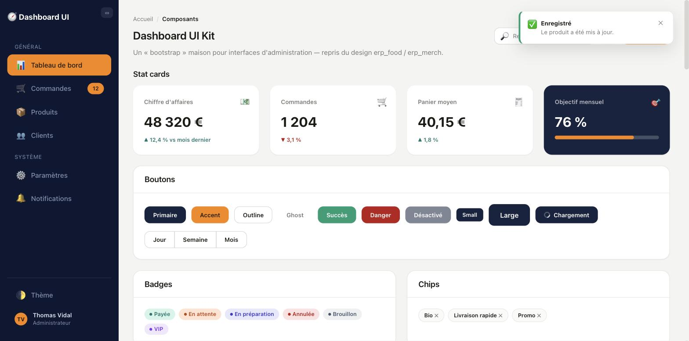

# Dashboard UI Kit

Un « bootstrap » maison en HTML/CSS/JS vanilla pour interfaces d'administration — le design est repris de `erp_food` / `erp_merch`, extrait ici en kit de composants réutilisable. Pas de framework, pas de build : un seul `index.html` + une seule feuille `style.css`.



## Lancer le projet

Fichiers statiques, aucune installation nécessaire :

```bash
open index.html
# ou, pour un rendu plus fidèle (fetch, chemins relatifs, etc.)
python3 -m http.server 8000
```

## Composants disponibles

### Structure
- **App shell** : sidebar + zone principale
- **Sidebar** : logo, bouton collapse, sections de navigation, items avec icône/label/badge, pied de sidebar (toggle thème, user chip avec avatar et déconnexion)
- **Topbar** : fil d'Ariane (breadcrumb), titre de page, champ de recherche, bouton icône avec pastille de notification, bouton d'action principal
- **Grille responsive** : `row` / `col-md-*`

### Données & indicateurs
- **Stat cards** : valeur + variation (hausse/baisse), variante "brand" avec barre de progression
- **Tableau** : en-têtes triables (indicateur ▲/▼), lignes zébrées, avatar + badge en cellule, actions, wrapper responsive, pagination
- **Progress bars** : défaut, succès, danger
- **Timeline**

### Actions & saisie
- **Boutons** : primaire, accent, outline, ghost, succès, danger, désactivé, tailles sm/lg, état chargement (spinner), groupe de boutons
- **Formulaires** : input, select, textarea, état invalide + message d'erreur, checkbox, radio, switch, dropzone (upload fichier)
- **Dropdown menu**
- **Tabs** : pills avec compteur, onglets soulignés
- **Stepper** (étapes de progression)

### Retours & statuts
- **Badges** : succès, attente, info, danger, neutre, VIP
- **Chips** (supprimables)
- **Alerts** : info, succès, attention, erreur (fermables)
- **Toasts** : notification succès
- **Tooltip**
- **Loading** : spinner, skeleton

### Contenus
- **Accordéon**
- **List group**
- **Hub cards** (raccourcis vers sections)
- **Empty state**

### Thème
- Bascule clair/sombre via `data-theme` sur `<html>` (bouton "Thème" dans la sidebar)

## Structure du projet

```
dashboard/
├── index.html    # démo de tous les composants
├── style.css     # design system (~1500 lignes)
└── docs/
    └── screenshot.jpg
```
